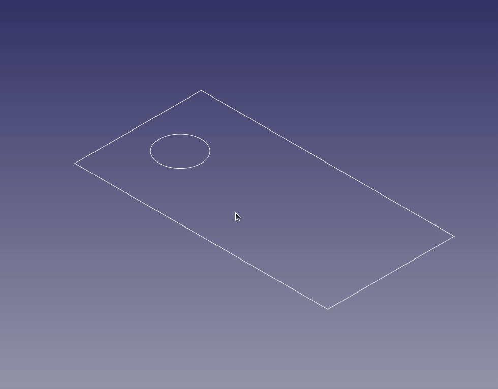
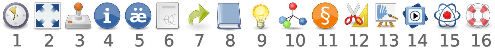

# addFC - additional tools for FreeCAD

Current version 3.0.0 - [release notes](CHANGELOG.md).

### Overview

This workbench contains tools that simplify solving certain tasks in FreeCAD.

At present, this is:

1. Generating a BOM from the model.
2. Batch processing of sheet metal parts.
3. Batch export to 3D formats.
4. Component library - [internal](addon/extra/library.md).
5. Assistance in creating design documentation.
6. Exploded view - [screencast](https://youtu.be/G9eikdejY6g).
7. Export models for viewing - [example](https://digiroad.tech/add/addFC/viewer.html).
8. Process automation.
9. Design aids.

This workbench is primarily considered an additional tool that expands functionality, not a standalone solution.

FreeCAD allows you to create custom toolbars. I recommend using this feature to build your own toolbar with the most frequently used functions and place it on your main workbench - for example, in the PartDesign workbench.

### Preview

Bill of materials - BOM

HUD (Head‑Up Display), smart panel - beta

Component library

Information about selected elements

Pipeline and pipe fittings

Explosion (30 FPS)

## Description

### Toolbox

1. Open the last working file
2. Isometric view and fit all objects
3. Execute the model control file
4. Bill of Materials (BOM) and related workflows
5. Add properties to an object
6. Create a drawing based on a template
7. Create a link(s) with specified parameters
8. Element and node library
9. Display information about selected elements
10. Exploded view
11. Create a pipe using points
12. Isolate selected objects
13. Export models for viewing
14. Recording the 3D viewport to a video file
15. HUD (Head‑Up Display) - beta, only for PartDesign (currently)
16. Documentation, help, and examples

### Documentation

[Quick reference guide](doc/quickstart_EN.md)

[Documentation](doc) available in PDF format (it is somewhat outdated...):

* [English](https://digiroad.tech/add/addFC/documentation_EN.pdf)
* [Russian](https://digiroad.tech/add/addFC/documentation_RU.pdf)

Forum:

* [FreeCAD forum thread](https://forum.freecad.org/viewtopic.php?t=91329)
* [FreeCAD тема на русском языке](https://forum.freecad.org/viewtopic.php?t=91598)

### Notes

The workbench is currently in development.

Testing primarily targets the old (0.21) stable version of FreeCAD.

__Warning: Potential sheet metal functionality issues in FreeCAD versions 1.0 and higher.__

If issues arise after updating, consider resetting preferences by deleting the configuration directory:

`FreeCAD/addData/pref`

## Installation

### Addon Manager

This workbench is available through the FreeCAD [Addon Manager](https://github.com/FreeCAD/FreeCAD-addons/#1-builtin-addon-manager) (menu __Tools__ > __Addon Manager__). It is called __addFC Workbench__ in the Addon Repository.

<b>Manual Installation (Click to expand)</b>

### Manual installation

Download the [archive](https://github.com/GS90/addFC/archive/main.zip), unzip it and move the __addFC__ folder to the directory containing all additional FreeCAD modules:

* Linux: `~/.local/share/FreeCAD/Mod`
* MacOS: `~/Library/Preferences/FreeCAD/Mod`
* Windows: `C:\Users\***\AppData\Roaming\FreeCAD\Mod`

Or, while in the directory with modules, use [git](https://git-scm.com):

`git clone https://github.com/GS90/addFC`

To update the module, while in the __addFC__ directory, use:

`git pull -r`

### Dependencies

Requirements:

* FreeCAD >= 0.21
* Python >= 3.10

For full functionality, you need:

* [FreeCAD SheetMetal Workbench](https://github.com/shaise/FreeCAD_SheetMetal) >= 0.6.13
* Additional Python Modules: [numpy](https://pypi.org/project/numpy) and [ezdxf](https://pypi.org/project/ezdxf)
* [FFmpeg](https://ffmpeg.org)

When installing the workbench using __Addon Manager__, all dependencies (except FFmpeg) will be installed automatically.

For manual installation of additional Python modules, use [pip](https://en.wikipedia.org/wiki/Pip_(package_manager)):

* `pip install numpy ezdxf`

## License

[LGPL-2.1-or-later](LICENSE)

[Workbench icons](https://en.wikipedia.org/wiki/Tango_Desktop_Project)
