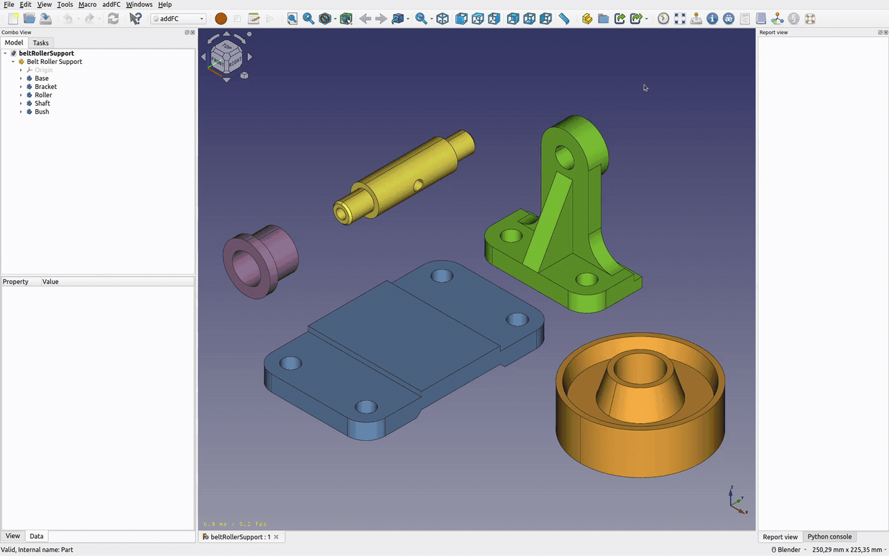
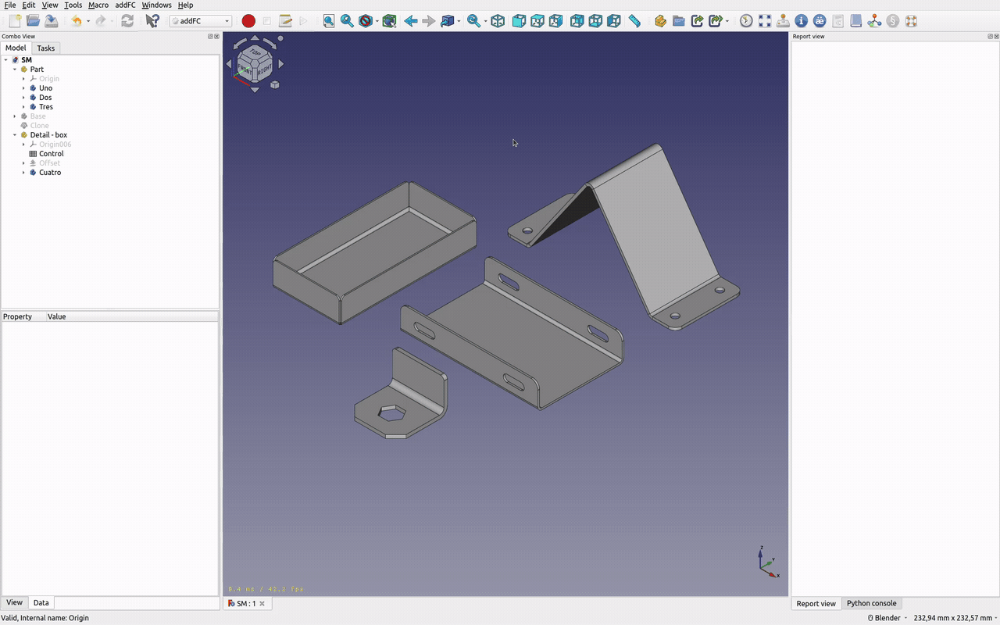

# addFC - quick reference guide

This guide contains simple examples of using the workbench.

### Content

1. [Filling objects with properties for accounting in the bill of materials](#filling-objects-with-properties-for-accounting-in-the-bill-of-materials)
2. [Basic work with sheet metal parts and their batch processing](#basic-work-with-sheet-metal-parts-and-their-batch-processing)

---

### Filling objects with properties for accounting in the bill of materials

Steps:

1. Select all the necessary objects in the 3D view window or in the model tree.
2. Click the **Add Properties** (key **A**) command on the toolbar.
3. Select the properties you need and enter their values ​​if necessary.
4. Click the **Add** button.

> The **Name** property is required for accounting in the bill of materials.

Open **Model Information** (key **I**) to display the current state of the model.

The **Indexing elements** button will automatically assign index numbers to objects in the bill of materials.

Screencast:

---

### Basic work with sheet metal parts and their batch processing

Steps:

1. Select all the necessary objects in the 3D view window or in the model tree.
2. Click the **Add Properties** (key **A**) command on the toolbar.
3. Check the **Sheet metal part** box.
4. If necessary, select the material for the parts.
5. Click the **Add** button.

Open **Model Information** (key **I**) to display the current state of the model.
Additional functions for working with sheet metal parts are located on the **Sheet Metal** tab.

The **Unfold** button will save the results of batch processing to the specified directory, to select the directory use the **Select a directory** button.

Screencast:

